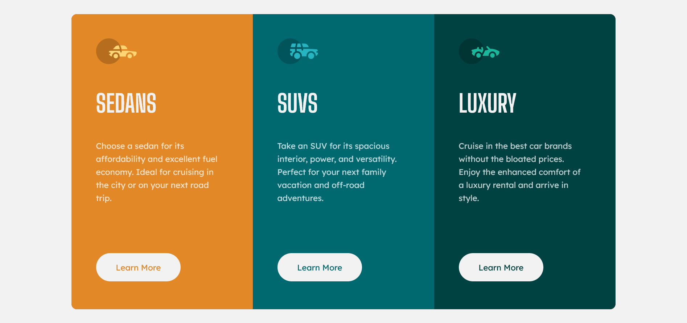

# Frontend Mentor - 3-column preview card component solution

This is a solution to the [3-column preview card component challenge on Frontend Mentor](https://www.frontendmentor.io/challenges/3column-preview-card-component-pH92eAR2-). Frontend Mentor challenges help you improve your coding skills by building realistic projects. 

## Table of contents

- [Overview](#overview)
  - [The challenge](#the-challenge)
  - [Screenshot](#screenshot)
  - [Links](#links)
- [My process](#my-process)
  - [Built with](#built-with)
  - [What I learned](#what-i-learned)
  - [Continued development](#continued-development)
- [Author](#author)


## Overview

### The challenge

Users should be able to:

- View the optimal layout depending on their device's screen size
- See hover states for interactive elements

### Screenshot



### Links

- Solution URL: https://jolly-chandrasekhar-7e81aa.netlify.app

## My process

### Built with

- Semantic HTML5 markup
- CSS custom properties
- Flexbox

### What I learned

The important thing that I have learned is that an anchor tag is an inline element. Therefore It can't have padding or it will overwrite the padding of the element next to it. This causes issues with the layout. Because of this I need to change the display of the element to inline-block. 

I also learned that sometimes there are rendering problems with google chrome. When i add a border to the parent div there arises a space between the border and child div. This isn't the case in Firefox. 

```css
a {
  display: inline-block;
}
```

### Continued development

I will continue to use flexbox for this type of projects. Also i need a little bit more of understanding of display property. 


## Author

- Frontend Mentor - [@Nova988](https://www.frontendmentor.io/profile/Nova988)
- Github - [Nova988] https://github.com/Nova988
